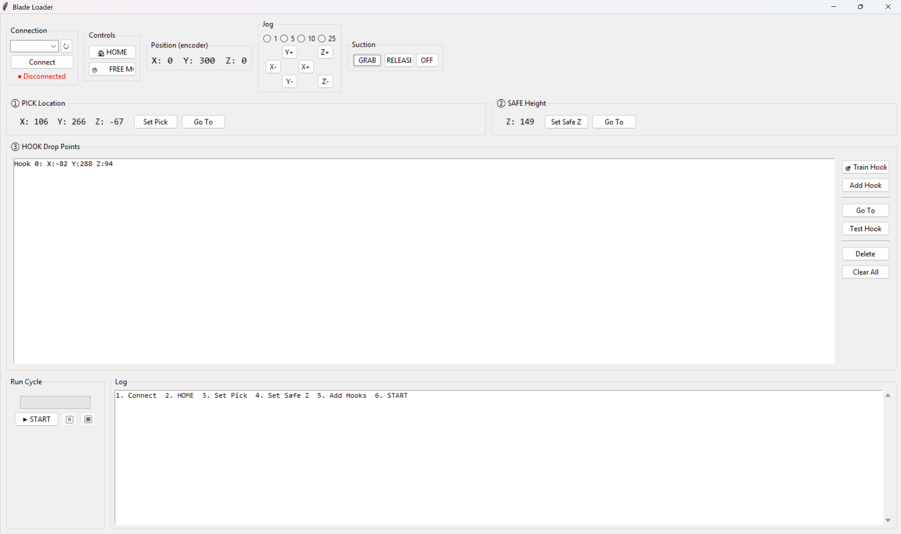

# DexArm Blade Loader

A teach-and-replay pick-and-place system for loading razor blades onto coating racks using the Rotrics DexArm robot arm.



## Setup

1. Install Python 3.8+ if not already installed
2. Install dependencies:
   ```
   pip install -r requirements.txt
   ```

3. Connect DexArm via USB

## Running the GUI

```
python blade_loader_gui.py
```

## How to Use

### 1. Connect
- Select the correct COM port from the dropdown
- Click **Connect**
- The arm will be set to Pneumatic module (suction cup) automatically

### 2. Teach Pick Position
- Use the **Jog Controls** to move the arm above your blade stack
- Click **Set Approach (hover)** - this is where the arm goes before/after picking
- Lower the arm to touch the top blade
- Click **Set Pick (down)** - this is where suction activates

### 3. Test Suction
- Use the **Suction Test** buttons to verify:
  - **GRAB** picks up a blade
  - **RELEASE** drops it
  - Adjust **Grab delay** if suction isn't establishing (try 0.8-1.0s)

### 4. Teach Hook Positions
For each hook on your curved rack:
1. Jog the arm above the hook
2. Click **Add Approach** (hover position)
3. Lower the arm so the blade slot aligns with the hook
4. Click **Add Hook** (drop position)
5. Repeat for all hooks

**Tip:** Go in order! Hook 0, then Hook 1, etc.

### 5. Run Cycle
- Click **START CYCLE**
- Watch the magic happen!
- Use **PAUSE** to temporarily stop
- Use **STOP** to abort (arm returns home)

## Files

| File | Description |
|------|-------------|
| `blade_loader_gui.py` | Main GUI application |
| `dexarm_controller.py` | Core DexArm control class |
| `blade_positions.json` | Saved positions (auto-created) |
| `requirements.txt` | Python dependencies |

## Positions File

Positions are saved to `blade_positions.json` and loaded automatically. You can back this up or share it. Example structure:

```json
{
  "pick": {"x": 150.0, "y": 200.0, "z": -50.0},
  "pick_approach": {"x": 150.0, "y": 200.0, "z": 0.0},
  "hooks": [
    {"x": -50.0, "y": 280.0, "z": -30.0},
    {"x": -25.0, "y": 290.0, "z": -30.0},
    {"x": 0.0, "y": 295.0, "z": -30.0},
    {"x": 25.0, "y": 290.0, "z": -30.0}
  ],
  "hook_approaches": [
    {"x": -50.0, "y": 280.0, "z": 0.0},
    ...
  ]
}
```

## Troubleshooting

| Problem | Solution |
|---------|----------|
| Blade not picked up | Increase grab delay, check suction cup seal |
| Blade drops early | Increase grab delay, check for air leaks |
| Position drift | Re-home the arm, re-teach positions |
| Can't connect | Check COM port, try unplugging/replugging USB |

## G-Code Reference

The controller uses these commands:

- `M888 P2` - Set pneumatic module
- `M1112` - Go home
- `G1 F2000 X_ Y_ Z_` - Move to position
- `M1000` - Suction ON (pump in)
- `M1002` - Suction release
- `M1003` - Pump off
- `M114` - Get current position
